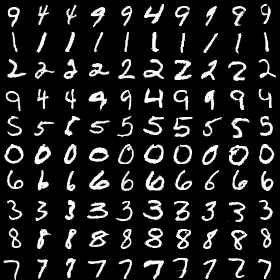

# InfoGAN

This repository was originally copied from https://github.com/openai/InfoGAN. The current version simply adds the CelebA experiment to the original repository which contained MNIST experiment only.

## Running in Docker

To run in docker, use the docker.sh script:

```bash
$ git clone git@github.com:nisace/gan-lib.git
$ cd gan-lib/
$ ./docker.sh {build, run} {cpu, gpu}
root@X:/gan-lib# python manage.py train -p {params/mnist.yml, params/celebA.yml}
```

## Seeing results

You can launch TensorBoard to view the generated images:

```bash
tensorboard --logdir logs/
```

## Examples of generated images
