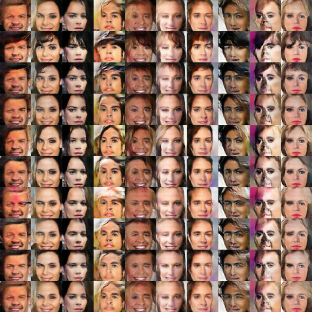

# GAN-lib

This repository was originally copied from https://github.com/openai/InfoGAN, the official implementation of https://arxiv.org/abs/1606.03657.
The current version adds the following:
- CelebA experiment (the original repository contained MNIST experiment only)
- Wasserstein GAN (https://arxiv.org/abs/1701.07875)
- CycleGAN (https://arxiv.org/abs/1703.10593)
- Sampling from a trained model

The next steps are to add experiments (ImageNet, CIFAR) and implement other GAN variants like SeqGAN, CatGAN,...

**Note:** The CycleGAN implementation slightly differs from the authors'
- The discriminator is trained with the last generated samples, not with samples from the history of the last samples
- The model was trained for 100 epochs instead of 200

## Running in Docker

To run in docker, use the docker.sh script. You can build the image or 
run the container and go inside it. Both commands are available in CPU and GPU versions. 

```bash
$ git clone git@github.com:nisace/gan-lib.git
$ cd gan-lib/
$ ./docker.sh {build, run} {cpu, gpu}
root@X:/gan-lib#
```

## Command line interface

All scripts are accessible through manage.py. The see help, execute the following command:

```bash
python manage.py --help
```

## Training a model

The model parameters are defined in a YML file. Some examples are given in software/params/.

```bash
python manage.py train -p {params/mnist.yml, params/celebA.yml, params/mnist_wasserstein_.yml, params/celebA_wasserstein.yml, params/horse_zebra.yml,...}
```

This will train the model and save it into ./ckpt/experiment_name/experiment_name_with_date/

Logs are saved in ./logs/experiment_name/experiment_name_with_date/

## Seeing results

You can launch TensorBoard to view the generated images:

```bash
tensorboard --logdir logs/
```

or give a specific logdir, for example:

```bash
tensorboard --logdir logs/mnist_infogan/mnist_infogan_2017_03_20_10_49_54/
```

## Sampling from a trained model

You can sample from a trained model:

```bash
python manage.py sample -p path/to/checkpoint.ckpt -s {random, latent_code_influence, linear_interpolation}
```

Example:

```bash
python manage.py sample -p ckt/mnist_infogan/mnist_infogan_2017_03_20_10_49_54/mnist_infogan_2017_03_20_10_49_54_400.ckpt -s random
```

## Examples
### MNIST:
#### Latent code influence
Samples showing the latent code influence. Along each column, the latent code is the same except for the category one hot encoding which has 10 classes and is learned in an unsupervised way with InfoGAN.


#### Linear interpolation
Linear interpolation in the latent space.


### CelebA:
#### Latent code influence
Example where one variable of the latent code has learned hair style (trained with InfoGAN). The second and third rows show different bangs length for example.



#### Linear interpolation


### MNIST Wassertein:


### CelebA Wassertein:


### CycleGAN
#### Horse to zebra


#### Zebra to horse


#### Failure case

