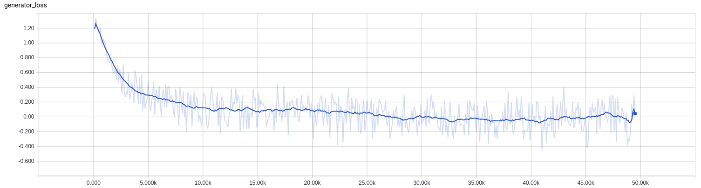

# InfoGAN

This repository was originally copied from https://github.com/openai/InfoGAN, the official implementation of https://arxiv.org/abs/1606.03657.
The current version adds the following:
- CelebA experiment (the original repository contained MNIST experiment only)
- Wasserstein GAN (https://arxiv.org/abs/1701.07875)

The next steps are to add experiments (ImageNet, CIFAR) and implement GAN variants like CatGAN or Unrolled GAN. 

## Running in Docker

To run in docker, use the docker.sh script:

```bash
$ git clone git@github.com:nisace/gan-lib.git
$ cd gan-lib/
$ ./docker.sh {build, run} {cpu, gpu}
root@X:/gan-lib# python manage.py train -p {params/mnist.yml, params/celebA.yml, params/mnist_wasserstein_.yml, params/celebA_wasserstein.yml,...}
```

## Seeing results

You can launch TensorBoard to view the generated images:

```bash
tensorboard --logdir logs/
```

## Sampling from a trained model

You can sample from a trained model:

```bash
python manage.py sample -p path/to/checkpoint.ckpt
```

Example:

```bash
python manage.py sample -p ckt/mnist_infogan/mnist_infogan_2017_03_20_10_49_54/mnist_infogan_2017_03_20_10_49_54_400.ckpt
```

## Examples

### MNIST:


### CelebA:


### MNIST Wassertein:


### CelebA Wassertein:



